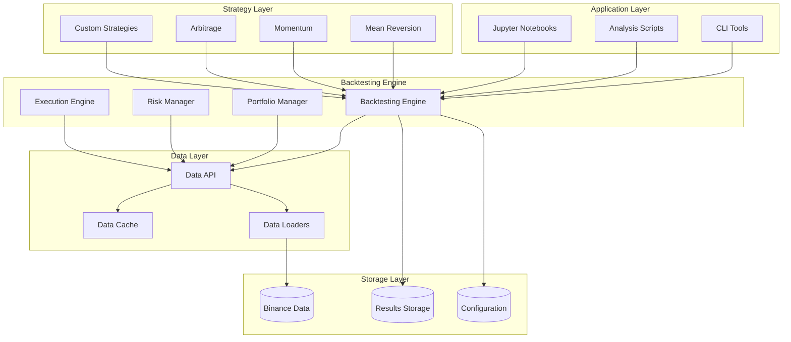

# Design Document

## Overview

This design restructures the existing cryptocurrency backtesting framework into a clean, modular architecture that separates concerns and supports multiple trading strategies. The new structure will provide better maintainability, testability, and extensibility while preserving all existing functionality.

The restructured framework will follow a layered architecture pattern with clear separation between data management, backtesting engine, strategy implementations, and analysis tools.

## Architecture

### High-Level Architecture



### Directory Structure

```
crypto_backtesting/
├── src/
│   ├── crypto_backtesting/
│   │   ├── __init__.py
│   │   ├── data/
│   │   │   ├── __init__.py
│   │   │   ├── loaders/
│   │   │   │   ├── __init__.py
│   │   │   │   ├── base.py
│   │   │   │   ├── binance.py
│   │   │   │   └── parquet.py
│   │   │   ├── providers/
│   │   │   │   ├── __init__.py
│   │   │   │   ├── base.py
│   │   │   │   └── binance_futures.py
│   │   │   ├── cache.py
│   │   │   └── manager.py
│   │   ├── backtesting/
│   │   │   ├── __init__.py
│   │   │   ├── engine.py
│   │   │   ├── portfolio.py
│   │   │   ├── execution.py
│   │   │   ├── risk.py
│   │   │   └── results.py
│   │   ├── strategies/
│   │   │   ├── __init__.py
│   │   │   ├── base.py
│   │   │   ├── pairs/
│   │   │   │   ├── __init__.py
│   │   │   │   ├── mean_reversion.py
│   │   │   │   ├── momentum.py
│   │   │   │   └── adaptive.py
│   │   │   └── utils/
│   │   │       ├── __init__.py
│   │   │       ├── indicators.py
│   │   │       └── signals.py
│   │   ├── analysis/
│   │   │   ├── __init__.py
│   │   │   ├── cointegration.py
│   │   │   ├── performance.py
│   │   │   ├── visualization.py
│   │   │   └── reports.py
│   │   └── utils/
│   │       ├── __init__.py
│   │       ├── config.py
│   │       ├── logging.py
│   │       └── helpers.py
├── scripts/
│   ├── collect_data.py
│   ├── find_pairs.py
│   ├── run_backtest.py
│   └── analyze_results.py
├── configs/
│   ├── default.yaml
│   ├── strategies/
│   └── data_sources/
├── data/
│   ├── raw/
│   ├── processed/
│   └── results/
├── tests/
│   ├── unit/
│   ├── integration/
│   └── fixtures/
├── docs/
├── requirements.txt
├── setup.py
└── README.md
```

## Components and Interfaces

### Data Layer

#### Data Manager (`src/crypto_backtesting/data/manager.py`)
Central interface for all data operations with caching and preprocessing capabilities.

```python
class DataManager:
    def __init__(self, config: DataConfig):
        self.providers = {}
        self.cache = DataCache()
        self.loaders = {}
    
    def get_market_data(self, symbols: List[str], start_date: str, end_date: str, 
                       timeframe: str = '1m') -> Dict[str, pd.DataFrame]
    
    def get_funding_rates(self, symbols: List[str], start_date: str, 
                         end_date: str) -> Dict[str, pd.DataFrame]
    
    def prepare_pair_data(self, symbol1: str, symbol2: str, 
                         start_date: str, end_date: str) -> pd.DataFrame
```

#### Data Providers (`src/crypto_backtesting/data/providers/`)
Abstract interface for different data sources with concrete implementations.

```python
class BaseDataProvider(ABC):
    @abstractmethod
    def get_klines(self, symbol: str, start_date: str, end_date: str, 
                   interval: str) -> pd.DataFrame
    
    @abstractmethod
    def get_funding_rates(self, symbol: str, start_date: str, 
                         end_date: str) -> pd.DataFrame

class BinanceFuturesProvider(BaseDataProvider):
    # Implementation for Binance futures data
```

#### Data Loaders (`src/crypto_backtesting/data/loaders/`)
Efficient data loading with format-specific optimizations.

```python
class ParquetLoader:
    def load_symbol_data(self, symbol: str, years: List[int], 
                        months: List[int]) -> pd.DataFrame
    
    def resample_data(self, data: pd.DataFrame, interval: str) -> pd.DataFrame
```

### Backtesting Engine

#### Main Engine (`src/crypto_backtesting/backtesting/engine.py`)
Core backtesting orchestrator that coordinates all components.

```python
class BacktestEngine:
    def __init__(self, config: BacktestConfig):
        self.data_manager = DataManager(config.data)
        self.portfolio_manager = PortfolioManager(config.portfolio)
        self.execution_engine = ExecutionEngine(config.execution)
        self.risk_manager = RiskManager(config.risk)
    
    def run_backtest(self, strategy: BaseStrategy, symbols: List[str], 
                    start_date: str, end_date: str) -> BacktestResults
```

#### Portfolio Manager (`src/crypto_backtesting/backtesting/portfolio.py`)
Handles position tracking, cash management, and portfolio valuation.

```python
class PortfolioManager:
    def __init__(self, initial_capital: float, position_sizing: PositionSizing):
        self.cash = initial_capital
        self.positions = {}
        self.position_sizing = position_sizing
    
    def calculate_position_size(self, signal: Signal, current_prices: Dict[str, float]) -> Dict[str, float]
    
    def update_positions(self, trades: List[Trade]) -> None
    
    def get_portfolio_value(self, current_prices: Dict[str, float]) -> float
```

#### Execution Engine (`src/crypto_backtesting/backtesting/execution.py`)
Simulates trade execution with realistic costs and slippage.

```python
class ExecutionEngine:
    def __init__(self, transaction_cost: float = 0.001, slippage_model: SlippageModel = None):
        self.transaction_cost = transaction_cost
        self.slippage_model = slippage_model
    
    def execute_trades(self, signals: List[Signal], current_data: pd.DataFrame) -> List[Trade]
    
    def calculate_execution_cost(self, trade: Trade) -> float
```

### Strategy Layer

#### Base Strategy (`src/crypto_backtesting/strategies/base.py`)
Abstract base class defining the strategy interface.

```python
class BaseStrategy(ABC):
    def __init__(self, config: StrategyConfig):
        self.config = config
        self.indicators = {}
    
    @abstractmethod
    def generate_signals(self, data: pd.DataFrame) -> List[Signal]
    
    @abstractmethod
    def get_required_data(self) -> List[str]
    
    def add_indicators(self, data: pd.DataFrame) -> pd.DataFrame
```

#### Pairs Strategies (`src/crypto_backtesting/strategies/pairs/`)
Specialized strategies for pairs trading with cointegration support.

```python
class PairsStrategy(BaseStrategy):
    def __init__(self, config: PairsStrategyConfig):
        super().__init__(config)
        self.pair_analyzer = PairAnalyzer()
    
    def validate_pair(self, symbol1: str, symbol2: str, data: pd.DataFrame) -> bool
    
    def calculate_spread(self, data: pd.DataFrame) -> pd.Series

class MeanReversionStrategy(PairsStrategy):
    # Implementation of mean reversion logic
```

### Analysis Layer

#### Cointegration Analysis (`src/crypto_backtesting/analysis/cointegration.py`)
Statistical analysis tools for pair discovery and validation.

```python
class CointegrationAnalyzer:
    def find_cointegrated_pairs(self, price_data: Dict[str, pd.Series], 
                               significance_level: float = 0.05) -> List[CointegrationResult]
    
    def test_pair_cointegration(self, series1: pd.Series, series2: pd.Series) -> CointegrationResult
    
    def analyze_spread_properties(self, spread: pd.Series) -> SpreadAnalysis
```

#### Performance Analysis (`src/crypto_backtesting/analysis/performance.py`)
Comprehensive performance metrics and risk analysis.

```python
class PerformanceAnalyzer:
    def calculate_metrics(self, returns: pd.Series, benchmark: pd.Series = None) -> PerformanceMetrics
    
    def calculate_drawdowns(self, portfolio_value: pd.Series) -> DrawdownAnalysis
    
    def generate_report(self, results: BacktestResults) -> PerformanceReport
```

## Data Models

### Core Data Structures

```python
@dataclass
class Signal:
    timestamp: pd.Timestamp
    symbol: str
    action: str  # 'BUY', 'SELL', 'CLOSE'
    quantity: float
    confidence: float = 1.0
    metadata: Dict[str, Any] = field(default_factory=dict)

@dataclass
class Trade:
    entry_time: pd.Timestamp
    exit_time: Optional[pd.Timestamp]
    symbol: str
    side: str  # 'LONG', 'SHORT'
    entry_price: float
    exit_price: Optional[float]
    quantity: float
    pnl: Optional[float] = None
    fees: float = 0.0
    metadata: Dict[str, Any] = field(default_factory=dict)

@dataclass
class BacktestResults:
    strategy_name: str
    start_date: str
    end_date: str
    initial_capital: float
    final_capital: float
    trades: List[Trade]
    portfolio_history: pd.DataFrame
    performance_metrics: PerformanceMetrics
    metadata: Dict[str, Any]
```

### Configuration Models

```python
@dataclass
class DataConfig:
    base_path: str
    cache_enabled: bool = True
    default_timeframe: str = '1m'
    providers: Dict[str, Any] = field(default_factory=dict)

@dataclass
class BacktestConfig:
    initial_capital: float = 100000.0
    transaction_cost: float = 0.001
    slippage_model: str = 'linear'
    data: DataConfig = field(default_factory=DataConfig)
    portfolio: PortfolioConfig = field(default_factory=PortfolioConfig)
    risk: RiskConfig = field(default_factory=RiskConfig)
```

## Error Handling

### Exception Hierarchy

```python
class BacktestingError(Exception):
    """Base exception for backtesting framework"""
    pass

class DataError(BacktestingError):
    """Data-related errors"""
    pass

class StrategyError(BacktestingError):
    """Strategy-related errors"""
    pass

class ExecutionError(BacktestingError):
    """Trade execution errors"""
    pass
```

### Error Handling Strategy

1. **Data Layer**: Graceful degradation with fallback data sources
2. **Strategy Layer**: Validation of inputs and outputs with clear error messages
3. **Execution Layer**: Robust handling of edge cases in trade execution
4. **Logging**: Comprehensive logging at all levels with configurable verbosity

## Testing Strategy

### Unit Testing
- **Data Layer**: Mock data providers, test data transformations
- **Strategy Layer**: Test signal generation with known inputs
- **Backtesting Engine**: Test portfolio calculations and trade execution
- **Analysis Layer**: Validate statistical calculations and metrics

### Integration Testing
- **End-to-End Backtests**: Run complete backtests with known datasets
- **Data Pipeline**: Test data loading and preprocessing workflows
- **Strategy Integration**: Validate strategy-engine interactions

### Performance Testing
- **Large Dataset Handling**: Test with multi-year datasets
- **Memory Usage**: Monitor memory consumption during backtests
- **Parallel Processing**: Validate concurrent operations

### Test Data Management
- **Fixtures**: Standardized test datasets for consistent testing
- **Mock Data**: Generated data for edge case testing
- **Historical Data**: Subset of real data for integration tests

## Migration Strategy

### Phase 1: Core Infrastructure
1. Set up new directory structure
2. Implement data layer with existing Binance data support
3. Create base classes and interfaces
4. Migrate existing backtesting engine functionality

### Phase 2: Strategy Migration
1. Migrate existing mean reversion strategies
2. Implement new strategy base classes
3. Add strategy validation and testing
4. Create strategy configuration system

### Phase 3: Analysis Tools
1. Migrate cointegration analysis tools
2. Implement performance analysis framework
3. Add visualization and reporting capabilities
4. Create analysis workflows and scripts

### Phase 4: Enhancement and Optimization
1. Add new data sources and providers
2. Implement advanced risk management
3. Add parallel processing capabilities
4. Optimize performance and memory usage

### Backward Compatibility
- Maintain existing script interfaces during transition
- Provide migration utilities for existing configurations
- Support both old and new data formats temporarily
- Clear deprecation warnings and migration guides